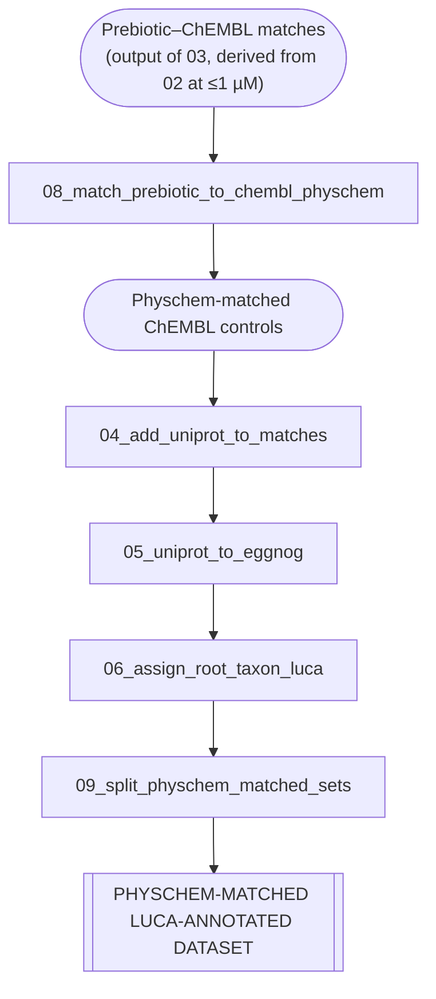

# Prebiotic-type small molecules preferentially bind ancient protein architectures

This repository contains the scripts and data used to generate the analyses and 
for the preprint:

**Espeland, L. O.**  
*Prebiotic-type small molecules preferentially bind ancient protein architectures*  
(preprint, 2026)

https://chemrxiv.org/doi/full/10.26434/chemrxiv.15000335/v1

The aim of this repository is to ensure full transparency and reproducibility of the
computational analyses presented in the manuscript.

---

## Overview

This project examines whether small molecules with prebiotic plausibility show
preferential binding to deeply conserved protein architectures inferred to trace back
to the last universal common ancestor (LUCA).  

To address this, prebiotic compounds were standardized and matched against
high-confidence protein–ligand binding data from ChEMBL, followed by taxonomic annotation
and statistical enrichment analyses.

---

## Repository contents

- `scripts/`  
   Scripts implementing the workflow described below.

- `environment/`  
  Conda environments used by scripts.

Datasets and processed result tables are hosted externally on Zenodo: 10.5281/zenodo.18475837.

---

## Analysis workflow

The analysis proceeds through the following steps:

1. **Prebiotic compound curation and standardization**  
   Prebiotic molecules were loaded from ChemOrigins and standardized using RDKit
   (normalization, reionization, metal removal, fragment selection, charge neutralization,
   and tautomer stabilization).

2. **ChEMBL data extraction**  
   ChEMBL 36 was queried for small-molecule binding activities restricted to:
   - Binding assays (`assay_type = 'B'`)
   - High assay confidence (`confidence_score ≥ 8`)
   - Single-protein targets
   - pChEMBL ≥ 6 (≤1 µM) or ≥ 4 (≤100 µM)

3. **Compound matching**  
   Prebiotic compounds were matched to ChEMBL ligands using standardized identifiers
   (InChIKey connectivity blocks).

4. **Target annotation**  
   Protein targets were annotated with taxonomic lineage information and classified
   according to LUCA conservation.

5. **Statistical analysis**  
   Enrichment statistics and Fisher’s exact tests were used to quantify preferential
   binding patterns.

6. **Physicochemical and similarity analysis**  
   Physicochemical properties of prebiotic compounds and ChEMBL compounds were
   compared, and structural similarity analyses were performed to assess chemical
   relatedness between prebiotic compounds and LUCA- and non-LUCA-binding ChEMBL compounds.

## Dataset Construction Pipeline

### A) Prebiotic Dataset Construction

### B) Clinical ChEMBL Dataset

### C) Physicochemically Matched Control Dataset

---

### D) LUCA Enrichment Statistics

---

### E) Physicochemical & Similarity Analyses

---

## Scripts

01_chemorigins_standardize_bins_fragments.py
Standardizes ChemOrigins compounds using RDKit, applies filtering, computes basic physicochemical properties, and bins compounds by molecular weight.

02_query_chembl_binding.py
Extracts high-confidence ChEMBL binding data. Run with --pchembl-min 6 (≤1 µM) and --pchembl-min 4 (≤100 µM) to generate separate datasets.

03_match_chemorigins_to_chembl_inchikey14.py
Matches prebiotic compounds to ChEMBL ligands using the InChIKey connectivity block (first 14 characters).

04_add_uniprot_to_matches.py
Maps ChEMBL targets to UniProt accessions.

05_uniprot_to_eggnog.py
Maps UniProt accessions to EggNOG orthologous groups.
Requires the eggnog conda environment.

06_assign_root_taxon_luca.py
Assigns a root taxon (LUCA, Bacteria, Archaea, or Eukaryota) to EggNOG groups based on cross-domain representation.
Requires the eggnog conda environment.

07_query_chembl_clinical.py
Extracts clinically investigated and approved ChEMBL compounds under the same criteria as script 02.

08_match_prebiotic_to_chembl_physchem.py
Generates physicochemically matched ChEMBL control sets for prebiotic compounds.

09_split_physchem_matched_sets.py
Defines analysis cohorts (prebiotic vs matched controls) and writes split dataset for matched control analysis.

10_luca_enrichment_fisher_compound_level.py
Performs compound-level LUCA enrichment analysis using Fisher’s exact test.

11_luca_enrichment_shared_targets.py
Computes LUCA enrichment using Fisher’s exact test based on shared protein targets.

12_stratified_fisher_by_target_count.py
Performs stratified enrichment analyses using Fisher’s exact test.

13_build_compound_level_luca_table.py
Builds compound-level LUCA summary tables.

14_physchem_summary_by_luca_status.py
Summarizes physicochemical properties by LUCA status.

15_physchem_summary_chembl_vs_prebiotic.py
Compares physicochemical properties of prebiotic compounds and ChEMBL compounds.

16_compute_prebiotic_similarity.py
Computes structural similarity metrics between prebiotic compounds and ChEMBL compounds.

17_similarity_summary_luca_vs_nonluca.py
Summarizes similarity distributions for LUCA and non-LUCA targets.

---

## Data files

### Raw data
The `data/raw/` directory hosted at Zenodo (DOI: 10.5281/zenodo.18475837) contains original input files but not external
resources (e.g. ChEMBL).

### Processed data
The `data/processed/` directory contains intermediate datasets generated during
filtering, matching, and annotation.

Some columns in these files are not used in the final statistical analyses but are
retained to ensure transparency and to allow alternative downstream analyses.

### Final data
The `data/final/` directory contains the tables used directly in the manuscript, SI and statistical analysees.

---

## Dependencies

Python libraries: pandas, numpy, rdkit, scipy.stats, sqlite3

External data required:

    ChEMBL 36 SQLite database (chembl_36.db)
    ChemOrigins molecule annotations (JSON)
    EggNog 6.0 Database (eggnog.db)
    STRING protein orthology (protein.orthology.v12.0.txt)
    NCBI taxonomy (nodes.dmp)

## License and citation

This repository is provided for academic use.

If you use or adapt this code or data, please cite the corresponding preprint.

---

